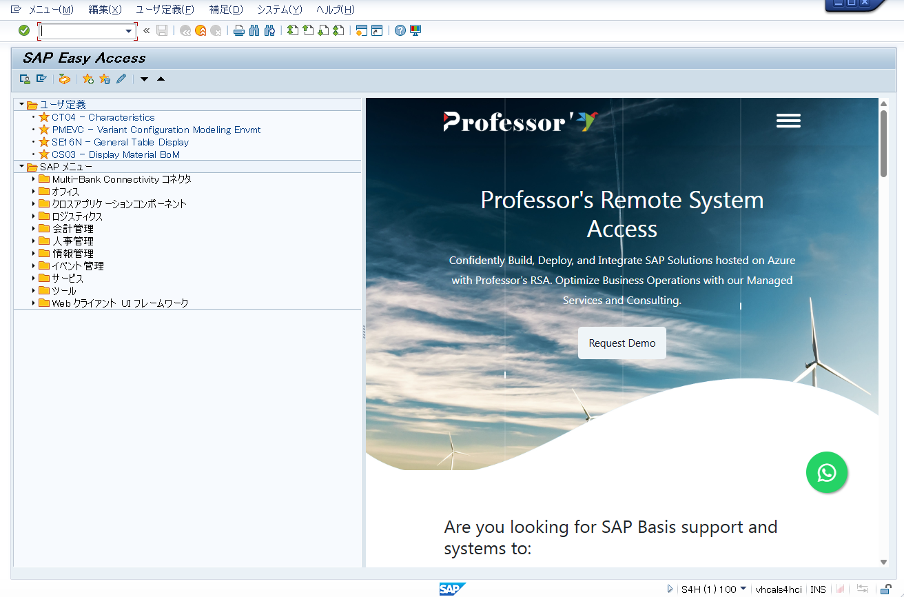

# SAP LEARNINGについて
SAP LEARNINGでは、実務経験に基づくナレッジ・知識をまとめたリポジトリです。
S/4 HANAのマイグレーションに関する、実務に即した内容になります。

# 概要
・環境： S/4HANA 2025

# コースについて
1. ECCからS/4 HANAへの移行
2. ECCからS/4HANA コーディング
3. アセスメント概要
4. アセスメントテーマ別調査
5. アドオン管理台帳の作成
6. SAPクエリ
7. プログラム改修パターン
8. プロト環境構築
9. 会計コンバージョン
10. 画面操作dTips
11. 品目マスタ管理と導入済みユーザーにおける運用
12. 品目登録の課題と課題解消のためのアドオンプログラム作成 